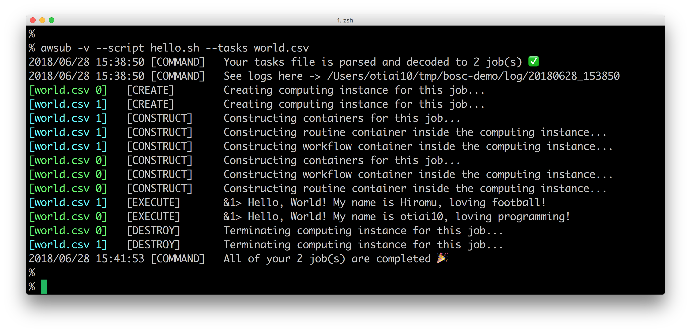

> This page describes how to get started with `awsub` command. 

# 0. Prerequisites

- [docker-machine](#docker-machine)
- [AWS CLI](#aws-cli)
- [gcloud](https://cloud.google.com/sdk/install){:target="_blank"}, if you want to try `awsub` on GCP

## docker-machine

You can skip this step if following command already works well on your computer.

```sh
% docker-machine version
```

Otherwise, you need to install `docker-machine`.

- [Install Docker Machine - Docker Documentation](https://docs.docker.com/machine/install-machine/){:target="_blank"}
- **or** [Docker Toolbox overview - Docker Documentation](https://docs.docker.com/toolbox/overview)

## AWS CLI

You can skip this step if following command already works well on your computer.

```sh
% aws configure list
```

Otherwise, you need to install `awscli` and configure it with your credentials.

- [Installing the AWS Command Line Interface - AWS Command Line Interface](https://docs.aws.amazon.com/cli/latest/userguide/installing.html){:target="_blank"}
- **and** [Configuring the AWS CLI - AWS Command Line Interface ](https://docs.aws.amazon.com/cli/latest/userguide/cli-chap-getting-started.html){:target="_blank"}

# 1. Install awsub



Choose binary for your OS from [this release page](https://github.com/otiai10/awsub/releases) and, if you want, locate extracted executable file to your `PATH`.

# 2. Hello World!

```sh
./awsub \
    --script hello.sh \
    --tasks world.csv \
    -v
```

`hello.sh` and `world.csv` are [like this](https://gist.github.com/otiai10/4dd9214d01ec933cb98204e426bf2c44){:target="_blank"}. You can just download these files to try.

When it works well, it will show you output like this



Let's read the log of this "Hello, World".

First, you can see your task file (`csv`) is parsed as 2 tasks, because it has 2 rows except for the header row, and the log folder specified.

After that, each color represents each VM's lifecycle. It `CREATE` each VM, `CONSTRUCT` containers in it, `EXECUTE` the shell script you specified, and finally it `DESTROY` so that nothing remains after your jobs get done.